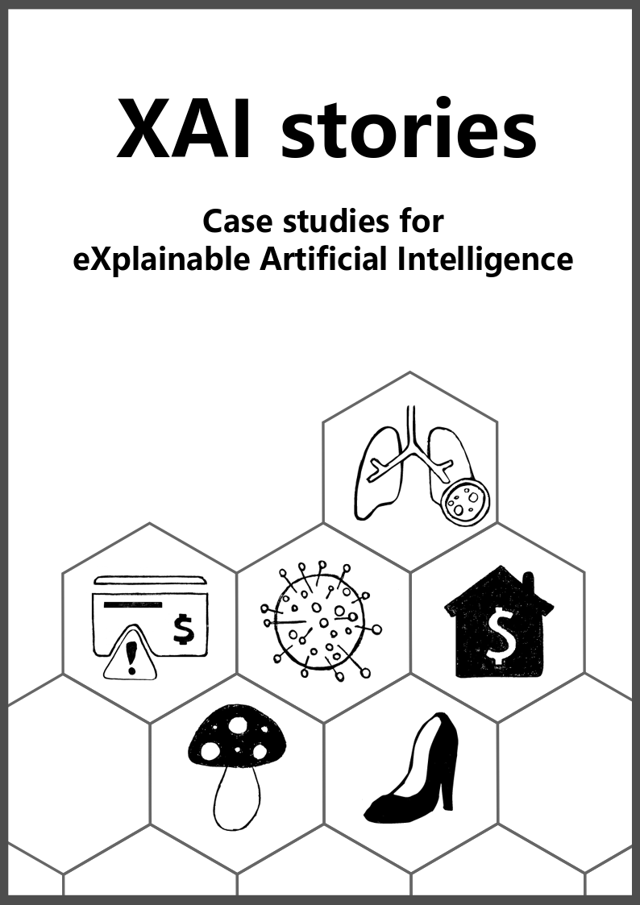
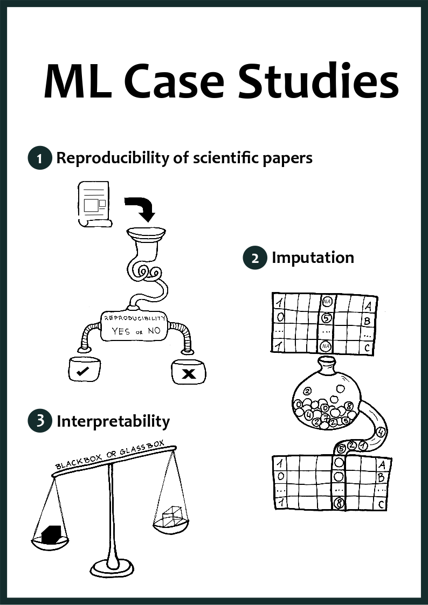
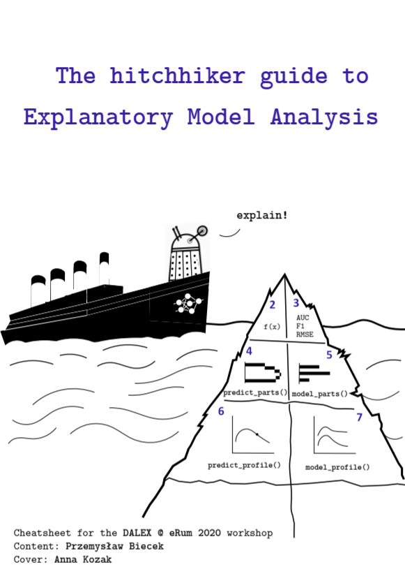
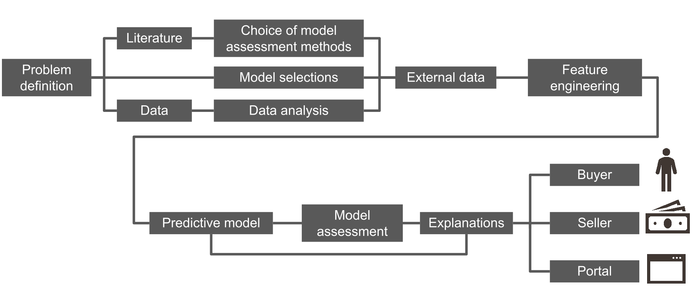
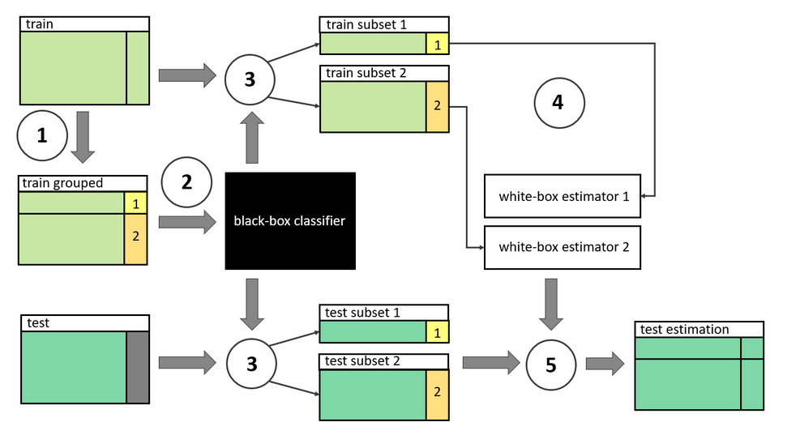
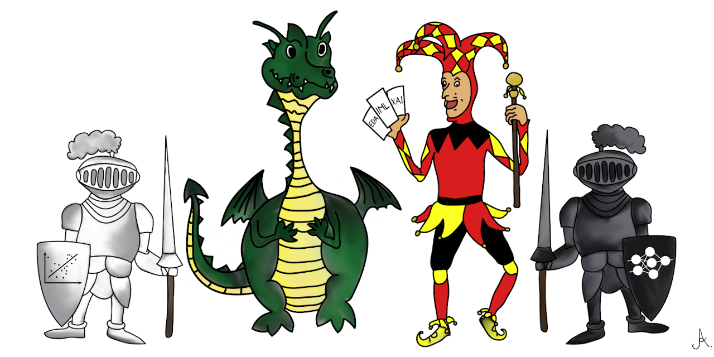

## Data Science Graphics
My graphics for Data Science

### Cover
- [XAI Stories](https://pbiecek.github.io/xai_stories/)

- [ML Case Studies](https://mini-pw.github.io/2020L-WB-Book/)

- [Workshop eRum 2020](https://github.com/pbiecek/XAIatERUM2020)

### Diagrams
- [Story House Sale Prices: eXplainable predictions for house sale](https://pbiecek.github.io/xai_stories/story-house-sale-prices.html#fig:plan)

- [ML Case Studies: Which Neighbours Affected House Prices in the ’90s?](https://mini-pw.github.io/2020L-WB-Book/which-neighbours-affected-house-prices-in-the-90s.html)

### Picture

- [Adversarial Interpretable Machine Learning](https://github.com/hbaniecki/awesome-adversarial-interpretable-machine-learning)

